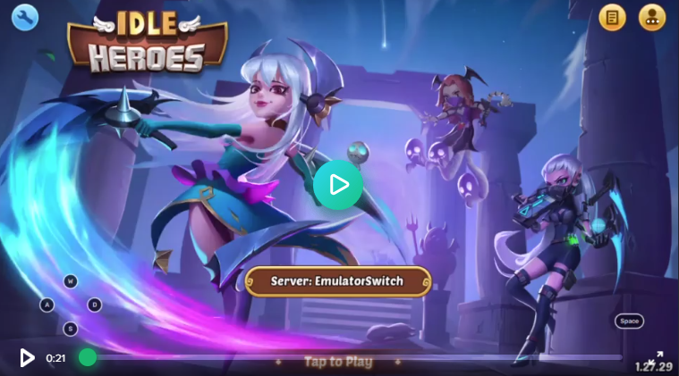

# Idle.Emu

[](https://i.imgur.com/OqGW3C9.mp4)

Server emulator of the popular mobile game. Features decryption and decompilation of the client as well as every protobuf definition that's being sent over the wire.


## Start
Run `Idle.Emu.Runner` and follow the steps below to connect to your phone or emulator to the server.

## Android
There's two ways to make the app connect to your server.

### Root or non-root
Modify `app/ui/login/gate.lua` and replace under `/data/user/0/$APP` if you're `root` or else re-pack and re-sign and re-install the APK after modification.

### Root
A simpler option as `root` using the official, unmodified app is to just route the traffic. This allows you to easily switch between the official and your local server.

```
$ echo 1 > /proc/sys/net/ipv4/ip_forward

# on, set ${IP} e.g 192.168.1.47
$ iptables -t nat -A OUTPUT -p tcp --dport 5000 -j DNAT --to-destination ${IP}:5000
$ iptables -t nat -A POSTROUTING -j MASQUERADE

# off, clears all NAT rules
$ iptables -t nat -F
```

## IOS
TBD
 
## Contributing
- `Lazy` evaluation and `Buffer.BlockCopy` + `ReadOnlySpan<T>` where applicable
- Favor `internal` and `sealed`. Internal interfaces <i>may</i> be placed in projects directory and be marked `internal`
- Tests should follow the [AAA](https://docs.microsoft.com/en-us/visualstudio/test/unit-test-basics?view=vs-2022#write-your-tests) standard
- Any new project must be named `Idle.Emu.X` with it's corresponding test project be named `Idle.Emu.X.Tests` and allow any `internal` to be exposed for testing
```    
 <ItemGroup>
    <AssemblyAttribute Include="System.Runtime.CompilerServices.InternalsVisibleTo">
        <_Parameter1>$(MSBuildProjectName).Tests</_Parameter1>
    </AssemblyAttribute>
 </ItemGroup>
 ```

## Projects
Any `Cocos.*` project are copied from an internal project which contains any helper functions to leverage apps using cocos2d.

### <b>Idle.Packet</b>
The reader and writer of the apps packet format. The app uses a streaming protocol with a header and a protobuf body.

### <b>Idle.Client</b>
The logic to decrypt and/or decompress the client. Features a fairly straightforward xor encryption found in the ARM binary. The embedded keys features as a decoy while the real key is being dervied from a hardcoded lookup table in the binary. Post decryption it's compressed with zlib and then ultimately compiled using a modified lua vm. The scrambled opcode map necessary to decompile or re-compile the lua code can be found in `opcode.txt` to use along with `unluac`

### Idle.Application
The controllers and services regarding receiving or processing packets. Handles any repository queries and mappings to the domain model. As of date, only a subset of the unary protobuf events are implemented under `Events`. However, `DebugPacket` allows <i>any</i> raw protobuf packet to be mapped to it's corresponding definition using reflection and logged as a JSON object.

### Idle.Domain
* Maintain a rich-domain model with logic to be used in any of the domain components unless it violates any of the solid principles. 
* Service injection are not prohibited but is <i>discouraged</i> if a `IValueObject` can take it's place in order to prevent an anemic domain model. 
* Favor the use `IValueObjects` over primitives, see `ICommodity`. 
* An `IAggregateRoot` <i>may not</i> depend on another root. 
* Any call to a concrete implementation <i>must</i> go through `Idle.Application`. 

Domain objects which makes use of <i>all</i> properties of the persistent model may use `MemberSerialization.OptIn` to allow serialization of domain objects directly even though a seperate record for persistence is to be preferred. Any serialization is still to be handled by an `IMapper` in `Idle.Application`.

### Idle.Emu.Genrator
Rebuilds the `.proto` files from the compiled `lua-protogen` files included in the app.
Parses the `eventName.lua` file to map each packet-id to it's corresponding protobuf definition. Use `IOutputGenerator` to start build an output generator for any desired language.

### Idle.Emu.Messags
Contains the generated `.proto` and `.cs` files from `Idle.Emu.Generator`. Includes the utility function mapping packet-id to our internal packet. The game maps their requests with identical <i>request</i> and <i>response</i> seeing most of their calls are unary and maintains two id's in form of <i>group</i> and <i>cmd</i>. This utility derives a unique ID from these four variables.

### Idle.Infrastructure
Contains the repositories for any `IAggregate` derivation in our domain. Inherit `BaseRepository` and `override` any of the `virtual` methods to use anything else but the default in-memory implementation. Any call to a concrete implementation must go through `Idle.Application`

### Idle.Global
Reads and features the global constants such as APK version and paths to any resources in which files can be placed in for any project. This allows version control for each resources and automatic access using
```
<ItemGroup>
    <ContentWithTargetPath Include="Resources\**">
      <CopyToOutputDirectory>PreserveNewest</CopyToOutputDirectory>
      <TargetPath>Resources\%(RecursiveDir)\%(Filename)%(Extension)</TargetPath>
    </ContentWithTargetPath>
</ItemGroup>
```


### Idle.Shared
Contains all the definitions `interfaces` used by most projects in this solution.
Includes a `Guard` class that should be favored in every `null` check to ease any error logging
